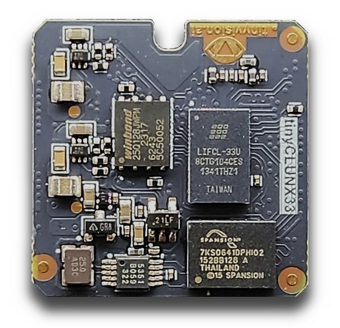
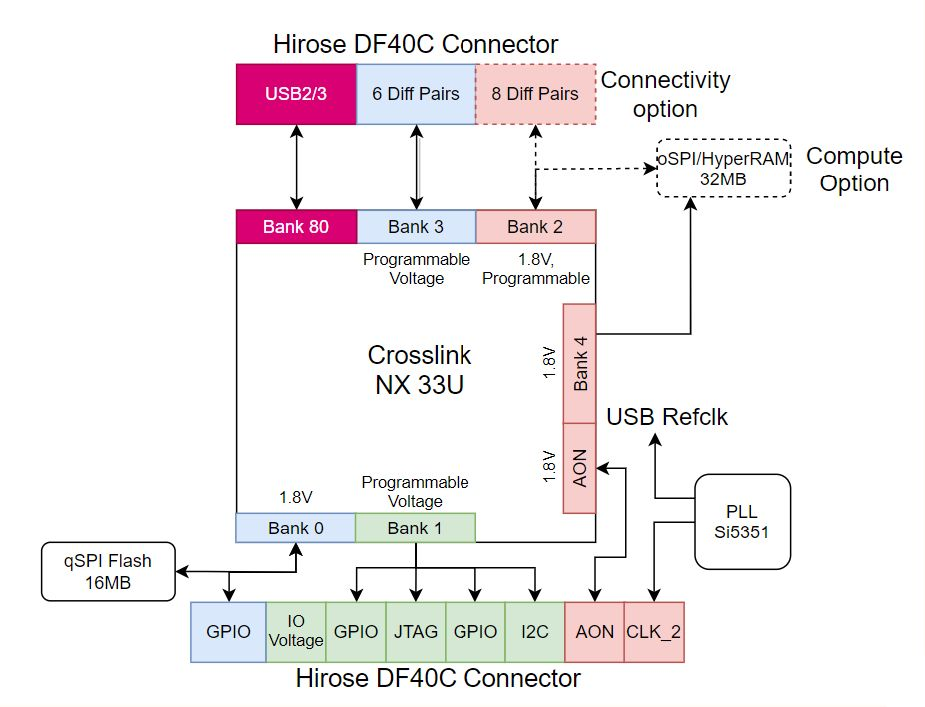

[Doc](https://tinyclunx33.tinyvision.ai/) |
[Hardware](https://github.com/tinyvision-ai-inc/tinyCLUNX33/tree/main/Schematics) |
[Firmware](https://docs.zephyrproject.org/latest/boards/riscv/tinyclunx33/doc/index.html) |
[Schematic](tinyCLUNX33_v2.0_Schematic.pdf) |
[Assembly](tinyCLUNX33_v2.0_Assembly.pdf) |
[Discord](https://discord.gg/yjVc6P3sCt)

25.4mm x 25.4mm x 4.5mm module, commercial temperature grade: 0°C to 85°C

Connector:
- 2x Hirose high density DF40C 60 pin connectors
- proven on thousands of SoM's in the field in high vibration environments
- Spare pins for future proofing

2 flavors:
- Connectivity: 14 diff pairs, no SSRAM
- Compute: 8 diff pairs, 32 MB oSPI/HyperRAM @ <0.5GBps

I/O interfaces:
- 3x fully programmable clocks
- GPIO, I2C, field updates through FPGA or direct flash programming
- GPIO voltage is programmable

Firmware/RTL:
- uPython for control path on RISCv
- No code, graphical RTL generator with large # of IP blocks (under development)

Development boards:
- development baseboard for programming/debug
- tinyCamera board as a basis of a compact camera device
- extra adapter boards for various camera connectors and expansion

